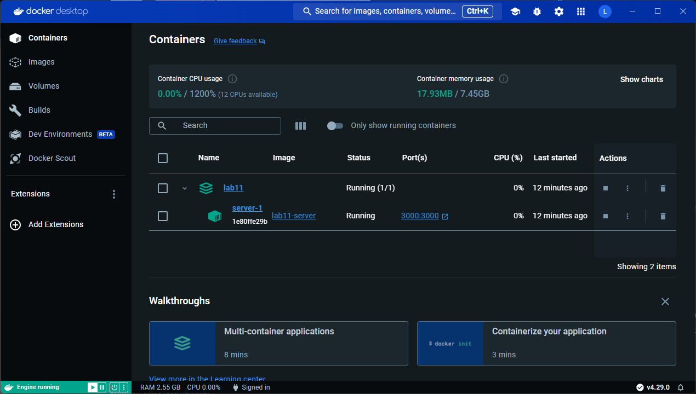

## 1. Download and install Docker

<figure>
  
  <figcaption><em>Docker Desktop</em></figcaption>
</figure>

## 2. Create a simple Express project

<figure>
  
  <figcaption><em>Express project</em></figcaption>
</figure>

## 3. Run this project

<figure>
  
  <figcaption><em>Docker build</em></figcaption>
</figure>

<figure>
  
  <figcaption><em>Express App</em></figcaption>
</figure>

## 4. Show the contents of the container and its logs

<figure>
  
  <figcaption><em>Docker Desktop Inspect Tab</em></figcaption>
  
  <figcaption><em>Docker Desktop Logs</em></figcaption>
</figure>

<figure>
  
  <figcaption><em>Docker Desktop Logs</em></figcaption>
</figure>
