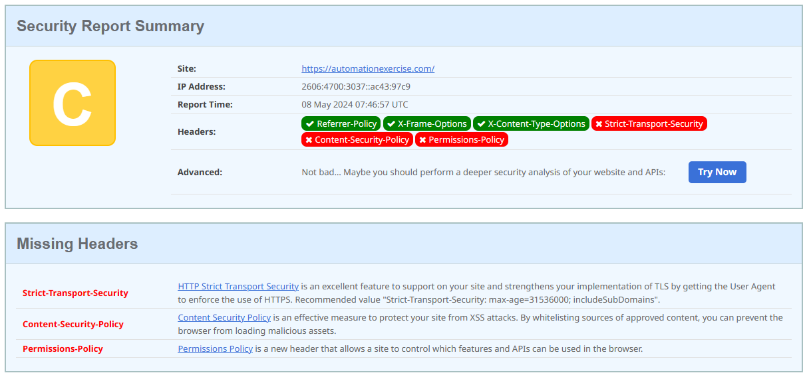

## Вразливості, знайдені за допомогою ZAP Scanner

1. **Absence of Anti-CSRF Tokens** - відсутність токенів Anti-CSRF у формі відправки HTML. CSRF - це атака, при якій зловмисник може змусити жертву виконати небажані дії на веб-сайті, де вона є аутентифікованю.
   - **_ДЛЯ ЗАПОБІГАННЯ ВРАЗЛИВОСТІ_** потрібно використовувати Anti-CSRF токени з будь-яким протоколом аутентифікації, де браузер автоматично відправляє облікові дані після входу користувача в систему.

2. **Content Security Policy (CSP) Header Not Set** - відсутність заголовка CSP. CSP - це безпековий заголовок, який дозволяє контролювати, з яких джерел браузер може завантажувати ресурси. Це може запобігти атакам XSS, оскільки можна обмежити виконання JS-скриптів до тих, які розміщені виключно на цьому сайті.
   - **_ДЛЯ ЗАПОБІГАННЯ ВРАЗЛИВОСТІ_** потрібно встановити заголовок CSP на веб-сервері, наприклад, `Content-Security-Policy: default-src 'self'`, щоб дозволити завантаження ресурсів тільки з вашого сайту.

3. **Server Leaks Information via "X-Powered-By" HTTP Response Header Field(s)** - витік інформації про сервер через поля заголовка HTTP-відповіді "X-Powered-By". Це вразливість, яка може дозволити зловмисниками отримати інформацію про використовуване ПЗ, яка потім може бути використана для ідентифікації потенційних вразливостей.
   - **_ДЛЯ ЗАПОБІГАННЯ ВРАЗЛИВОСТІ_** потрібно вимкнути заголовок "X-Powered-By". Наприклад, для HTTP-серверу Apache необхідно додати такий рядок коду у файл конфігурації серверу: `ServerTokens Prod`. Для Nginx - `server_tokens off;`.

4. **Strict-Transport-Security Header Not Set** - відсутність заголовку HSTS. HSTS - це заголовок, який повідомляє браузеру, що він повинен завжди завантажувати сайт, використовуючи HTTPS і автоматично перетворювати усі способи доступу до сайту за допомогою HTTP на запити HTTPS
   - **_ДЛЯ ЗАПОБІГАННЯ ВРАЗЛИВОСТІ_** потрібно додати заголовок `Strict-Transport-Security` на веб-сервер.

5. **Vulnerable JS Library** - вразливість, яка виникає, коли використовується JS-бібліотека, яка не має необхідних оновлень безпеки. Такі бібліотеки можуть привести до різних вразливостей DOM, включаючи DOM-XSS, які можуть бути використані для захоплення облікових записів користувачів.
   - **_ДЛЯ ЗАПОБІГАННЯ ВРАЗЛИВОСТІ_** потрібно оновити усі використовувані бібліотеки до останньої версії. Ті, які більше не використовуються - видалити, щоб зменшити "поверхню", яка потенційно може бути атакована.

## Сканування сайту https://automationexercise.com/ за допомогою [Security Headers](https://securityheaders.com/)

Для покращення безпеки сайт, рекомендується додати наступні заголовки:

1. **Strict-Transport-Security (STS)**: запобігає атакам "людина посередині", перетворюючи усі спроби доступу до сайту за допомогою HTTP та HTPS; повідомляє браузеру, що він повинен завжди завантажувати сайт, використовуючи HTTPS.
2. **Content-Security-Policy (CSP)**: допомагає виявляти та зменшувати певні типи атак, включаючи атаки XSS; дозволяє контролювати ресурси, які користувацький агент може завантажувати для даної сторінки.
3. **Permissions-Policy**: надає механізм для дозволу та заборони використання функцій браузера в документі або всередині будь-яких елементів `<iframe>` в документі. `Permissions-Policy` дозволяє сайту верхнього рівня визначити, що він та його треті сторони мають намір використовувати, і знімає тягар з користувача визначати, чи є запит на доступ до функції законним чи ні2. Наприклад, блокуючи функцію геолокації для всіх третіх сторін за допомогою `Permissions-Policy`, розробник може бути впевнений, що жодна третя сторона не отримає доступ до геолокації користувача.
